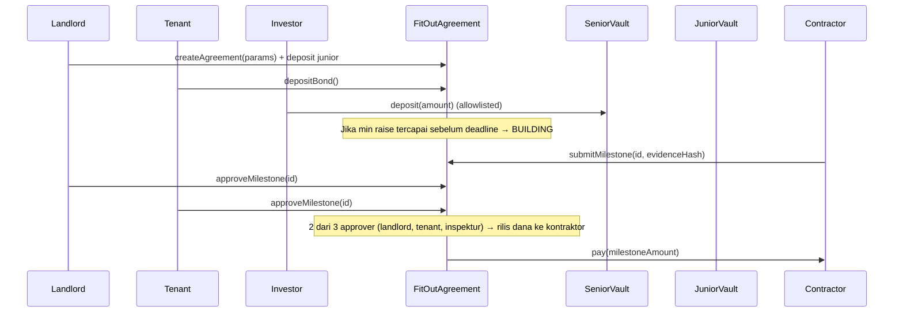
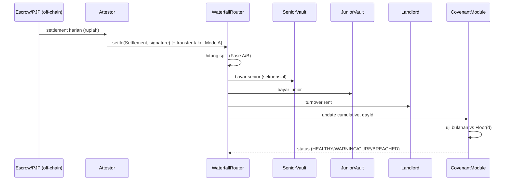

# 04 — System Architecture

**Versi:** 0.1 · 5 Okt 2026 · Bergantung pada: `00`, `01`, `02`, `03` · Dipakai oleh: `05`, `06`

---

## 1. Prinsip arsitektur

1. **Hybrid:** uang rupiah dan penegakan hukum tetap di dunia berizin/Web2. Onchain menyediakan ledger, mesin waterfall, dan covenant yang dapat diverifikasi (NN-01, DC-01).
2. **Minimal on-chain value:** hanya bagian omzet yang menjadi hak pihak non-tenant yang pernah menyentuh kontrak; tenant retain tidak pernah onchain (DC-01).
3. **Satu sumber kebenaran omzet:** attestation settlement dari rekening escrow/PJP, bukan laporan tenant.
4. **Trust assumption diakui, bukan disembunyikan:** attestor dan arbiter adalah titik kepercayaan; dicatat dan dikurangi bertahap (bagian 5).
5. **Jam logis:** waktu kontrak mengikuti `dayId` dari attestation sehingga demo bisa dipercepat tanpa mengubah block time.
6. **Modular:** logika waterfall identik di mode A dan B; hanya adapter pembayaran yang berbeda.

## 2. Aktor dan peran

| Aktor | Peran onchain | Peran off-chain | Kunci/alamat |
|---|---|---|---|
| Pemilik ruko (Landlord) | Pemegang tranche junior; penerima turnover rent; approver milestone | Pemilik properti, penandatangan sewa | EOA/multisig |
| Tenant | Penyetor bond; pelaksana cure top-up; approver milestone | Operator usaha | EOA |
| Investor senior | Penyetor ke senior vault; pemegang shares | KYC via agen/mitra (pilot) | EOA (allowlisted) |
| Kontraktor | Penerima pembayaran milestone | Pelaksana renovasi | EOA |
| Inspektur independen | Approver milestone ke-3 | Pemeriksa kemajuan fisik | EOA |
| Attestor (agen escrow/PJP) | Menandatangani settlement harian (EIP-712) | Memegang rekening settlement rupiah | EOA/HSM (produksi); script mock (demo) |
| Arbiter | Menandai hari excused; menyelesaikan sengketa milestone; memicu step-in manual jika oracle mati lama | Pihak netral (mis. mitra/profesional) | Multisig (produksi); EOA (demo) |
| Operator protokol (admin) | Deploy dan konfigurasi awal; pause darurat | Tim | Multisig |

Detail matriks akses fungsi: `05_SMART_CONTRACT_SPEC.md`, bagian 6.

## 3. Komponen sistem (lapisan)

```
┌────────────────────────────────────────────────────────────────────────┐
│ LAPISAN 4 — UI (Next.js / wagmi / viem)                                │
│  Dashboard 4 peran · Panel skenario · Simulator ekonomi                │
├────────────────────────────────────────────────────────────────────────┤
│ LAPISAN 3 — ONCHAIN (Solidity, EVM testnet)                            │
│  FitOutAgreement  ·  WaterfallRouter  ·  TrancheVault x2 (ERC-4626)    │
│  CovenantModule   ·  BondEscrow       ·  MilestoneEscrow               │
├────────────────────────────────────────────────────────────────────────┤
│ LAPISAN 2 — ATESTASI (off-chain)                                       │
│  Mock Attestor (script TS) → produksi: API PJP/agen escrow             │
│  Menghasilkan Settlement{dayId, periodDays, G, txCount, evidenceHash}  │
├────────────────────────────────────────────────────────────────────────┤
│ LAPISAN 1 — REL PEMBAYARAN (dunia nyata, berizin)                      │
│  Pelanggan → QRIS → rekening settlement escrow (rupiah)                │
│  Produksi: PJP/bank berizin · Demo: disimulasikan                      │
└────────────────────────────────────────────────────────────────────────┘
```

Lapisan 1 dan sebagian lapisan 2 hanya **disimulasikan** pada hackathon (NN-09).

## 4. Mode A dan Mode B

| Aspek | Mode A (Demo/Testnet) | Mode B (Pilot/Regulated) |
|---|---|---|
| Dana onchain | Ya (MockIDR) | Tidak; hanya entitlement ledger |
| Pembayaran investor/pemilik | Transfer token dari router | Rupiah dibayarkan agen berizin sesuai entitlement onchain |
| Tenant retain | Tetap off-chain (tenant memegang sendiri) | Tetap di rekening tenant |
| Attestation | Mock attestor | Agen/PJP menandatangani settlement nyata |
| Tujuan | Demo mekanisme dan UI | Menjaga kepatuhan (DC-01, DC-02) |
| Adapter | `TokenPayoutAdapter` | `LedgerPayoutAdapter` (emit event entitlement; saldo klaim dihitung) |

Logika waterfall, covenant, dan state machine **identik**; hanya `PayoutAdapter` yang berbeda. Di MVP hanya Mode A yang diimplementasikan; Mode B didokumentasikan sebagai antarmuka (stub) agar arah jelas.

## 5. Model kepercayaan (Trust Model)

| Titik kepercayaan | Apa yang bisa salah | Mitigasi MVP | Mitigasi produksi |
|---|---|---|---|
| Attestor | Memalsukan atau menahan data omzet; mengatur jam logis | Satu address per agreement, tidak dapat diganti setelah aktif; semua attestation berupa event publik | Agen berizin + audit; multi-attestor; cross-check bukti hash |
| Arbiter | Menyalahgunakan excused day atau keputusan sengketa | Batas `N_excused`; semua tindakan emit event; multisig | Panel arbiter, mekanisme banding, SLA |
| Admin | Menghentikan kontrak/mengubah konfigurasi | Parameter agreement immutable setelah FUNDRAISING; pause hanya menunda settlement, tidak mengambil dana | Timelock, multisig, audit |
| Tenant | Kebocoran tunai, data bohong di luar rel | Payment floor, bond, cross-check off-chain, mystery shopper | Integrasi POS/pembelian, pemeriksaan acak |
| Kontraktor/inspektur | Persetujuan milestone palsu | Persetujuan 2 dari 3 pihak (landlord, tenant, inspektur) + hash bukti | Inspektur terakreditasi, foto/geotag bukti |
| Kode | Bug logika | Invariant test + fuzz (lihat 05, bagian 9) | Audit pihak ketiga |

**Pernyataan jujur untuk pitch:** kepercayaan dipindahkan dari "satu pihak memegang buku" menjadi "attestor menandatangani fakta settlement yang bisa diverifikasi publik"; bukan dihapus.

## 6. Alur utama

### 6.1 Siklus hidup agreement (state machine ringkas)

```
DRAFT → FUNDRAISING → BUILDING → OPERATING → RESIDUAL → CLOSED
              │            │          │
              ▼            ▼          ▼
        FAILED_REFUND  ABORTED_    STEP_IN → LIQUIDATING → CLOSED
                       REFUND
(OPERATING memiliki sub-status covenant: HEALTHY / WARNING / CURE / BREACHED / ORACLE_STALE)
```

### 6.2 Pendanaan dan renovasi



### 6.3 Settlement harian, waterfall, covenant



### 6.4 Eskalasi covenant

1. Uji bulanan: `Shortfall > ε × C` → status CURE, emit `CureStarted(deadlineDay)`.
2. Tenant memanggil `cureTopUp(amount)` → masuk waterfall sebagai pembayaran investor.
3. Setelah `D_cure` hari logis, jika masih kurang → `drawBond()` otomatis oleh `evaluate()`.
4. Bond tak cukup atau pelanggaran berturut-turut (≥ 2 uji) → STEP_IN → proses off-chain (fidusia, pengambilalihan, lelang aset bergerak) → `recordRecovery(amount)` dan `recordWriteOff()` → LIQUIDATING → CLOSED.

### 6.5 Penutupan normal
Setelah C_s dan C_j lunas → Fase B (residual) sampai akhir masa sewa. Pada akhir sewa: `close()` mengembalikan bond sisa ke tenant, menutup vault, dan mengizinkan penarikan sisa kas.

## 7. Model waktu

- Semua perhitungan waktu memakai `dayId` (hari logis) dari attestation, bukan `block.timestamp`.
- `dayId` harus naik monoton; satu settlement per `dayId` (idempoten). Boleh ada celah (hari tanpa data → status unknown).
- Uji bulanan terjadi tiap `dayId` melewati kelipatan 30 sejak `startDay`.
- Batas waktu (fundraising, build) memakai `block.timestamp` atau `dayId` secara konsisten per fase; **keputusan:** fundraising/build deadline memakai `block.timestamp` (kontrak belum punya attestation sebelum OPERATING), sedangkan OPERATING dan seterusnya memakai `dayId`. Lihat D-07 di `09`.
- Konsekuensi: attestor menentukan kecepatan jam logis. Diterima karena attestor sudah menjadi titik kepercayaan (bagian 5); untuk demo ini membuat skenario deterministik.

## 8. Model data

### 8.1 On-chain (entitas utama)

| Entitas | Field utama |
|---|---|
| `Params` (immutable setelah FUNDRAISING) | budget, seniorPrincipal, juniorPrincipal, seniorMultipleBps, juniorMultipleBps, investorTakeBps, landlordTakeBps, royaltyBps, landlordTakeBpsPhaseB, targetTenorDays, maxTenorDays, floorRatioBps, toleranceBps, cureDays, healthWindowDays, healthFloorDaily (informatif), maxExcusedDays, bondAmount, assumedCostRatioBps, fundraiseDeadline, buildDeadline, leaseEndDay, milestoneBps[] (daftar lengkap dan validasi: lihat `05`, bagian 3) |
| `Parties` | landlord, tenant, contractor, inspector, attestor, arbiter, asset (token) |
| `State` | phase, covenantStatus, startDay, lastDayId, cumulativeInvestorPaid, seniorPaid, juniorPaid, bondBalance, excusedDays, breachCount, cureDeadlineDay |
| `Milestone[]` | id, amountBps atau amount, evidenceHash, approvals bitmap, released |
| `SettlementRecord` | dayId, grossRecorded, splits (landlord, senior, junior, retainOrExcess), evidenceHash |
| Vault accounting | `idleCash`, `deployed`, `claimPaid`, `writeOff` per tranche |

### 8.2 Off-chain (mock attestor / dashboard)

- `settlements.json` (data simulasi): daftar harian G, evidenceHash, nonce.
- Konfigurasi skenario: kurva omzet, kebocoran, hari excused, titik default.
- Metadata UI: nama fiktif pihak, label peran, teks penjelasan.

### 8.3 Privasi
Tidak ada PII onchain (DC-06). `evidenceHash` = hash dari dokumen/bukti yang disimpan off-chain (IPFS atau penyimpanan terkontrol); isi dokumen tidak di-onchain-kan.

## 9. Penanganan kegagalan sistem

| Kegagalan | Perilaku sistem |
|---|---|
| Attestor mati (tak ada settlement ≥ 3 hari logis berturut-turut) | Status ORACLE_STALE; uji covenant dijeda; event untuk dashboard; setelah 14 hari logis arbiter dapat memicu eskalasi manual |
| Attestation duplikat/replay | Ditolak: `dayId` sudah ada atau nonce terpakai |
| Attestation dengan `dayId` lebih lama dari `lastDayId` | Ditolak (monoton) |
| Signature tidak valid | Ditolak |
| Transfer token gagal (mode A) | Seluruh settlement revert; tidak ada split parsial |
| Pause aktif | Settlement ditolak; jam logis tidak maju; tidak ada penarikan dana oleh admin |
| Fundraising kurang dari minimum | FAILED_REFUND; semua deposit dapat ditarik penuh |
| Build lewat deadline | ABORTED_REFUND; sisa dana yang belum dicairkan dikembalikan pro-rata |
| Sengketa milestone | Arbiter memutuskan setuju/tolak dengan alasan (hash); event publik |

## 10. Pilihan teknologi (rekomendasi default; konfirmasi di OQ-01/OQ-02)

| Area | Pilihan | Catatan |
|---|---|---|
| Bahasa kontrak | Solidity ^0.8.24 | |
| Framework | Foundry (forge test, fuzz, invariant) | |
| Library | OpenZeppelin Contracts v5 (ERC4626, AccessControl, ReentrancyGuard, SafeERC20, ECDSA/EIP712) | |
| Chain | Sepolia (default untuk Ethereum hackathon) | Konfirmasi syarat hackathon (OQ-01) |
| Token | `MockIDR` ERC-20, 6 desimal | Tidak mengklaim IDRX |
| Frontend | Next.js + TypeScript + wagmi + viem | Baca event langsung, tanpa subgraph di MVP |
| Attestor | Script Node/TypeScript menandatangani EIP-712 | |
| Simulator | TypeScript (modul bersama yang dipakai UI dan tes) | Lihat 02, bagian 11 |
| Penyimpanan bukti | Hash saja di MVP | IPFS opsional (P2) |

## 11. Non-functional requirements

| ID | Kebutuhan |
|---|---|
| NFR-01 | Setiap perubahan state penting memancarkan event (untuk dashboard dan audit). |
| NFR-02 | Tidak ada fungsi privileged tanpa dokumentasi dan event. |
| NFR-03 | Semua operasi aritmetika memakai integer; pembulatan terdokumentasi. |
| NFR-04 | Waktu respons dashboard < 2 detik untuk pembacaan state di testnet. |
| NFR-05 | Demo dapat dijalankan ulang dari awal dengan satu perintah (script deploy + seed). |
| NFR-06 | Semua parameter tampil di UI beserta label asumsi. |
| NFR-07 | Kode dan dokumen berlabel testnet/mock (NN-09). |
