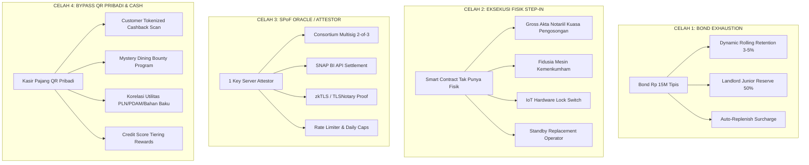

# 13 — Mitigasi Keamanan Finansial & Operasional: Solusi 4 Celah Kritis

**Versi:** 1.0 · 7 Oktober 2026  
**Status:** Dokumen Strategis & Spesifikasi Solusi  
**Konteks:** Menjawab Evaluasi Kritis & Celah Logika Protokol RBF Ruko (Persiapan Ethereum Hackathon Jakarta 2026 & Uji Lapangan Pilot Jember)  
**Dokumen Pendukung:** `02_ECONOMIC_MODEL.md`, `03_REGULATORY_LEGAL.md`, `04_SYSTEM_ARCHITECTURE.md`, `05_SMART_CONTRACT_SPEC.md`, `07_RISK_STRESS_TEST_QA.md`, `12_PRODUCT_BRAINSTORMING_AND_FAQ.md`

---

## Executive Summary: Melampaui "Naive Web3"

Salah satu kelemahan terbesar proyek Real World Asset (RWA) Web3 adalah asumsi yang terlalu naif (*crypto-utopian assumption*): menganggap bahwa kode smart contract di blockchain secara magis dapat mengontrol dunia fisik dan perilaku manusia.

Pada realitas operasional ruko komersial di Indonesia (khususnya wilayah suburban seperti Jember), protokol menghadapi **4 batasan struktural besar**:
1. **Bond Rp 15 Juta Terlalu Tipis:** Hanya bertahan 1,4 bulan jika terjadi defisit pembayaran bulanan ($Floor = \text{Rp } 10,67\text{ juta}$).
2. **Smart Contract Tidak Bisa Eksekusi Fisik (*Physical Step-In Trap*):** Blockchain tidak bisa mendobrak pintu ruko, mengusir barista, atau menyita mesin kopi tanpa benturan hukum pidana (Pasal 167 KUHP).
3. **Titik Tunggal Kegagalan Oracle (*Single Point of Failure* pada Attestor):** Ketergantungan pada 1 private key server penandatangan EIP-712 membuka celah sentralisasi, kebocoran kunci, atau macetnya sistem (*stall*).
4. **Bypass QRIS via Rekening Pribadi / Uang Tunai Gelap (*Rogue QR & Dark Cash*):** Kasir dapat dengan mudah menempelkan QRIS pribadi (DANA/BCA/GoPay) di meja kasir dan meminta pembeli scan QR pribadi dengan iming-iming bonus/diskon.

Dokumen ini merumuskan **solusi teknis, kriptografis, hukum, dan ekonomi perilaku (*behavioral economics*)** yang komprehensif, teruji, dan dapat diimplementasikan untuk menutup keempat celah tersebut secara berlapis (*Defense-in-Depth*).

---



---

## 🛡️ Solusi Celah 1: Arsitektur Ketahanan Modal (*Bond Sizing & Exhaustion*)

### 1.1. Anatomi Masalah
* **Parameter Dasar:** Pokok Senior Rp 120.000.000, target pengembalian 1,25× = Rp 150.000.000 dalam 14 bulan operasional. Target *Payment Floor* bulanan:
  $$\text{Floor}_{\text{bulanan}} = \frac{\text{Rp } 150.000.000}{14} = \text{Rp } 10.666.665/\text{bulan}$$
* **Kerapuhan:** Bond di muka disepakati Rp 15.000.000 (10% dari total capex Rp 150jt). Jika omzet kedai anjlok 50% atau mengalami kebocoran tunai 40%, defisit bulanan sekitar Rp 5–7 juta. Dalam **2 bulan**, bond langsung habis terkuras.
* **Dilema:** Menaikkan bond di muka menjadi Rp 45.000.000 (menutup 4 bulan) akan membunuh proposisi nilai *low-barrier to entry* bagi tenant UMKM.

### 1.2. Solusi 3 Lapis: *Dynamic Multi-Tier Reserve Architecture*

#### A. Mekanisme Dynamic Rolling Retention (Akumulasi Bond Otomatis)
Alih-alih menuntut modal besar di muka, protokol menerapkan mekanisme pemotongan bertahap saat omzet berada di atas rata-rata:
1. **Inisiasi Awal:** Tenant menyetor Rp 15.000.000 di muka (*Base Seed Bond*).
2. **Surplus Skimming:** Pada hari-hari di mana omzet harian melampaui $115\%$ dari target harian normal ($\text{Omzet} > \text{Rp } 1.725.000/\text{hari}$):
   * Sebesar $3\%$ dari porsi kas tenant ($80\%$) dialihkan ke dalam on-chain sub-account **`RollingBondReserve`**.
   * Pemotongan berlanjut hingga saldo total bond mencapai plafon aman: **Rp 35.000.000** (setara ~3,3 bulan cicilan).
3. **End-of-Contract Yield Cashback:** Jika tenant menyelesaikan seluruh kewajiban hingga Multiple 1,25× tanpa pernah mengalami default permanen:
   * Seluruh akumulasi `RollingBondReserve` dikembalikan 100% ke rekening tenant.
   * Ditambah bonus yield (bunga simpanan) sebesar 3–5% p.a. dari hasil yield staging pool. Ini mengubah beban bond menjadi tabungan wajib produktif (*forced savings with yield*).

#### B. Landlord Secondary Liquidity Buffer (Co-Bonding Pemilik Ruko)
Pemilik ruko berada di tranche Junior dan menerima *Turnover Rent* 5% setiap hari.
* **Protokol Rule:** Dari 5% *Turnover Rent* yang menjadi hak pemilik ruko, sebesar $40\%$ dialokasikan otomatis ke dalam **`JuniorReservePool`** sampai terkumpul Rp 10.000.000.
* **Fungsi:** Jika bond tenant tersedot habis (Rp 15jt habis), `JuniorReservePool` bertindak sebagai bantalan likuiditas kedua (*Tier-2 Liquidity Shield*) sebelum kontrak memvonis default pada tranche Senior.
* **Rasional:** Pemilik ruko adalah pihak yang paling diuntungkan dari peningkatan nilai fisik properti (*capital appreciation*), sehingga wajar ikut menyerap risiko likuiditas jangka pendek.

#### C. Auto-Replenishment Surcharge (Pemulihan Otomatis)
Jika terjadi penarikan bond (misal terpotong Rp 4.000.000 di bulan ke-2 akibat omzet turun):
* Begitu omzet pulih di atas target Floor, take-rate otomatis bertambah $2\%$ (misal dari 20% menjadi 22%) sampai saldo bond kembali ke level awal Rp 15.000.000.
* Ini mencegah efek bola salju di mana bond yang terkuras membuat sistem kehilangan proteksi di sisa tenor.

---

## ⚖️ Solusi Celah 2: Jembatan Hukum-Fisik Eksekusi Hak Step-In (*Physical-Legal Enforcement*)

### 2.1. Anatomi Masalah
Smart contract di jaringan Ethereum/Base hanya bisa memodifikasi angka di storage node (`contractState = State.DEFAULT`, `stepInAuthorized = true`).
* Secara fisik, ruko tetap dikunci oleh penyewa lama.
* Mencongkel gembok atau memindahkan perabot secara paksa tanpa izin pengadilan dapat dijerat pidana **Pasal 167 KUHP** (memasuki pekarangan tertutup tanpa hak) dan **Pasal 335 KUHP** (perbuatan tidak menyenangkan/pemaksaan).
* Interior fit-out (cat dinding, partisi gipsum, saluran pipa) tidak likuid dan tidak bisa dicopot.

### 2.2. Solusi 4 Pilar Integrasi Hukum & IoT

```text
┌────────────────────────────────────────────────────────────────────────┐
│                          KONSENSUS ON-CHAIN                            │
│  State: CURE Expired (7 hari) ──► STATE: DEFAULT Terkonfirmasi (Event) │
└──────────────────────────────────┬─────────────────────────────────────┘
                                   │
                ┌──────────────────┴──────────────────┐
                ▼                                     ▼
┌───────────────────────────────┐   ┌──────────────────────────────────┐
│        EKSEKUSI LEGAL         │   │          KONTROL HARDWARE        │
│ • Gross Akta Notariil Aktif   │   │ • Revokasi Akses Smart Lock      │
│ • Parate Eksekusi Fidusia     │   │ • Pemutusan Router WiFi / POS    │
│ • Surat Peringatan Final (SP3)│   │ • Pengalihan CCTV Cloud Log      │
└───────────────┬───────────────┘   └─────────────────┬────────────────┘
                └──────────────────┬──────────────────┘
                                   ▼
┌────────────────────────────────────────────────────────────────────────┐
│                 PENGAMBILALIHAN OPERATOR PENGGANTI                     │
│  Replacement Operator (Mitra Agregator F&B) Masuk Dalam 48 Jam         │
│  Peralatan & Ruang Dikelola Kembali ──► Arus Kas Investor Berlanjut     │
└────────────────────────────────────────────────────────────────────────┘
```

#### A. Instrumen Hukum: Gross Akta Pengosongan Notariil di Muka
Saat penandatanganan perjanjian pembiayaan sebelum pencairan dana renovasi:
1. **Bukan Sekadar Perjanjian di Bawah Tangan:** Tenant menandatangani **Akta Pengosongan Sukarela Notariil** yang mencantumkan klausula eksekutorial (*Gross Akta*).
2. **Klausul Irah-Irah:** Akta berkepala *"DEMI KEADILAN BERDASARKAN KETUHANAN YANG MAHA ESA"*. Menurut Pasal 224 HIR / 258 RBg, akta ini memiliki kekuatan eksekutorial yang setara dengan Putusan Pengadilan yang berkekuatan hukum tetap (*inkracht*).
3. **Syarat Tangguh (*Condition Precedent*):** Akta secara eksplisit menyatakan bahwa jika terdapat catatan wanprestasi yang dibuktikan dengan log on-chain dan somasi tertulis 7 hari kerja yang diabaikan, hak sewa tenant gugur seketika dan pemilik ruko berhak mengosongkan tempat tanpa perlu mengajukan gugatan perdata biasa yang memakan waktu bertahun-tahun.

#### B. Jaminan Fidusia Terdaftar untuk Peralatan Komersial Bernilai Tinggi
* Barang-barang bergerak bernilai tinggi yang dibeli dari anggaran renovasi (mesin espresso komersial 2-group, coffee grinder, kulkas undercounter, genset) didaftarkan melalui **Jaminan Fidusia Elektronik di Ditjen AHU Kemenkumham**.
* Sertifikat Fidusia memberikan hak preferen kepada pengelola escrow/wakil investor untuk melakukan penjualan di bawah tangan atau lelang eksekusi secara sah menurut UU No. 42 Tahun 1999 tentang Jaminan Fidusia.

#### C. Smart IoT Lock & Digital Killswitch Infrastructure
* **Biaya Investasi Rendah:** Dipasang kunci pintu pintar komersial (*IoT Smart Deadbolt / Shutter Switch*, estimasi biaya Rp 800.000 – Rp 1.500.000) dan router IoT ruko yang terhubung ke cloud backend.
* **Mekanisme Otomasi:**
  * Dalam kondisi normal (`HEALTHY`), tenant memegang hak akses PIN master pintu.
  * Ketika smart contract bertransisi ke `State.DEFAULT` (dikonfirmasi melalui multisig tim resolusi):
    * Kunci pintu otomatis mencabut PIN kasir/barista lama pada pukul 23:59 WIB.
    * PIN darurat baru dikirimkan secara terenkripsi ke pemilik ruko dan tim pengawas operasional.

#### D. Standby Replacement Operator Registry (Operator Penyelamat)
* **Kenyataan:** Investor di Jakarta atau luar negeri tidak mungkin datang ke Jember untuk meracik kopi atau menjalankan kedai.
* **Solusi Protokol:** Protokol membangun konsorsium kemitraan dengan **Agregator Kuliner Lokal / Jaringan Waralaba Kopi** (misal: jaringan kedai lokal di Jawa Timur).
* **Kontrak Siaga (*Standby SLA*):** Operator siaga telah menandatangani kesepakatan awal: jika unit ruko mengalami default, mereka siap mengambil alih operasional dalam waktu maksimal **7 hari kalender**.
  * Mereka membawa pasokan bahan baku dan barista mereka sendiri.
  * Memanfaatkan interior dan peralatan yang sudah jadi.
  * Skema bagi hasil disesuaikan kembali (misal take-rate dinaikkan menjadi 25% hingga kewajiban tranche senior terlunasi penuh).

---

## 🔗 Solusi Celah 3: Desentralisasi Oracle & Ketahanan Attestor (*Attestor SPoF & Integrity*)

### 3.1. Anatomi Masalah
* Saat ini kontrak memverifikasi tanda tangan tunggal:
  ```solidity
  address signer = ECDSA.recover(digest, signature);
  require(signer == attestorAddress, "INVALID_SIGNER");
  ```
* **Risiko Fatal:**
  1. **Private Key Server Bocor:** Peretas dapat memalsukan settlement omzet nol selama 14 hari berturut-turut untuk memicu default palsu dan mencuri bond, atau memalsukan omzet miliaran untuk menarik liquidity share.
  2. **Server Down / Crash:** Jika server backend mati saat cut-off harian, kontrak mengalami `ORACLE_STALE` dan seluruh fungsi pembagian hasil terhenti.

### 3.2. Solusi 4 Pilar Desentralisasi Oracle

#### A. M-of-N Threshold Multisig Attestation (2-of-3 Node Konsensus)
Menghapus penandatangan tunggal (*single signer*). Attestasi harian wajib memuat tanda tangan minimal **2 dari 3 node independen**:

| Node | Operator | Sumber Data Verifikasi |
|---|---|---|
| **Node 1: Payment Gateway Node** | Backend PJP / Midtrans / DOKU | Webhook real-time QRIS & notifikasi transfer bank |
| **Node 2: Escrow Bank Validator Node** | Server Agen Kustodian / BPR Mitra | Rekening koran mutasi resmi via SNAP BI API |
| **Node 3: Independent Watcher Node** | Jaringan Oracle Eksternal (Chainlink Function / Gelato) | Query terjadwal ke endpoint settlement terotentikasi TLS |

Di smart contract:
```solidity
function settleRevenueMultiSig(
    DaySettlement calldata report,
    bytes[] calldata signatures
) external {
    bytes32 digest = _hashTypedDataV4(keccak256(abi.encode(REPORT_TYPEHASH, report)));
    require(signatures.length >= 2, "INSUFFICIENT_SIGNATURES");
    
    address lastSigner = address(0);
    for (uint256 i = 0; i < signatures.length; i++) {
        address signer = ECDSA.recover(digest, signatures[i]);
        require(isApprovedAttestor[signer], "NOT_AN_ATTESTOR");
        require(signer > lastSigner, "SIGNERS_MUST_BE_SORTED_AND_UNIQUE");
        lastSigner = signer;
    }
    _executeSettlement(report);
}
```

#### B. Pemanfaatan zkTLS / TLSNotary (Kriptografi Verifikasi Bank Tanpa API Khusus)
* Mengintegrasikan protokol **zkTLS** (seperti Reclaim Protocol atau Opacity Network).
* Agen escrow atau tenant membuka portal internet banking rekening penampung resmi. Melalui protokol zkTLS:
  * Bukti kriptografis (*zero-knowledge proof*) dibuat langsung dari sesi TLS browser dengan web server Bank (BCA / Mandiri / BRI).
  * Membuktikan secara matematis bahwa server bank mengirim respons berisi teks: *"Kredit mutasi rekening nomor 143-xxx sebesar Rp 1.540.000 pada tanggal 07-10-2026"*.
  * Proof tersebut diverifikasi oleh smart contract verifier **tanpa ada pihak ketiga yang memegang private key bank** dan tanpa membocorkan kredensial rahasia nasabah.

#### C. Invariant Guardrails & Circuit Breakers (Pembatas Risiko On-Chain)
Untuk mencegah eksploitasi jika konsensus oracle tetap terkompromi:
1. **`MAX_DAILY_SETTLEMENT_CAP`:** Settlement omzet harian dibatasi maksimal $3\times$ dari rata-rata historis (misal batas atas Rp 15.000.000/hari untuk ruko kedai 40 kursi). Jika di atas angka ini, dana masuk ke `PendingSettlement` dengan timelock 24 jam sebelum dialokasikan.
2. **`MIN_SIGNER_CHANGE_TIMELOCK`:** Penggantian alamat attestor tidak bisa dilakukan instan oleh admin; wajib melalui timelock 48 jam dengan pemancaran event publik on-chain agar semua pihak dapat memverifikasi.

---

## 🧾 Solusi Celah 4: Deteksi & Pencegahan Bypass QR Pribadi / Uang Tunai Gelap (*Rogue QRIS & Cash Leakage*)

### 4.1. Anatomi Masalah
Kelemahan terbesar di lapangan:
* Kasir menempelkan QRIS pribadi (DANA/BCA pribadi) di samping QRIS escrow resmi.
* Kasir membujuk pembeli: *"Kak, bayar ke QR yang ini aja ya, dapet diskon Rp 2.000 atau gratis topping!"*
* Akibatnya: Pembeli membayar tunai atau transfer ke rekening pribadi tenant. Mutasi rekening resmi tercatat sepi, sistem mengira ruko merugi padahal omzet mengalir ke kantong pribadi kasir.

### 4.2. Solusi 4 Pilar: Menghancurkan Insentif Kecurangan

```text
┌────────────────────────────────────────────────────────────────────────┐
│                   SENJATA 1: KONSUMEN SEBAGAI AUDITOR                  │
│  Scan QR Resmi ──► Struk Kasir Berisi Kode Tiket Web App               │
│  Konsumen Klaim: Cashback 5-10% Rupiah/Diskon + Tiket Undian Bulanan    │
│  *Jika bayar ke QR pribadi kasir = Tidak dapat cashback/tiket*          │
└──────────────────────────────────┬─────────────────────────────────────┘
                                   │
                                   ▼
┌────────────────────────────────────────────────────────────────────────┐
│               SENJATA 2: DECENTRALIZED MYSTERY SHOPPER                 │
│  Komunitas / Mahasiswa Lokal Diajak "Audit Makan Gratis"               │
│  Kasir tawarkan QR pribadi? ──► Foto & Laporkan ke Portal Bounty       │
│  Reward: Rp 250.000 Tunai dari Pemotongan Saldo Jaminan Tenant         │
└──────────────────────────────────┬─────────────────────────────────────┘
                                   │
                                   ▼
┌────────────────────────────────────────────────────────────────────────┐
│                 SENJATA 3: KORELASI SILANG UTILITAS                    │
│  Korelasi Triangulasi: Listrik kWh (PLN) + Air (PDAM) + Biji Kopi      │
│  Dapur sibuk & Listrik 2.500 kWh, tapi QRIS cuma Rp 200rb/hari?        │
│  ──► Status Kontrak Otomatis: ANOMALY_INVESTIGATION TRIGGERED          │
└──────────────────────────────────┬─────────────────────────────────────┘
                                   │
                                   ▼
┌────────────────────────────────────────────────────────────────────────┐
│                SENJATA 4: INCENTIVE CARROT OVER STICK                  │
│  Reputation Credit Score: Capai target omzet 1.25x lebih cepat         │
│  ──► Sisa omzet 100% milik tenant + Diskon tarif modal di ruko ke-2    │
└────────────────────────────────────────────────────────────────────────┘
```

#### A. Tokenized Customer Rebate: Menjadikan Pelanggan sebagai Satpam Protokol
Kasir tidak bisa mencurangi sistem jika **pelanggan menolak membayar ke QR pribadi**.
1. **Dynamic Customer Incentive:**
   * Setiap transaksi yang masuk melalui QRIS Escrow resmi menghasilkan ID Transaksi unik pada struk (atau notifikasi scan sukses).
   * Pelanggan membuka portal web/Telegram bot Rukoma/FitOut Vault, memasukkan nomor referensi QRIS, dan langsung mendapatkan **Cashback 5% – 10%** (atau kupon potongan harga kopi berikutnya).
   * Dana insentif ini disisihkan dari alokasi marketing protokol (sebesar 1–2% dari volume).
2. **Psikologi Konsumen:**
   * Jika kasir menyodorkan QR pribadi: *"Bayar ke sini aja mas"*, pelanggan akan **menolak**: *"Loh kok QR-nya beda mas? Nanti saya nggak dapet cashback dan kupon undian bulanan dong!"*
   * Pelanggan memaksa kasir menggunakan QR resmi tanpa perlu pengawasan fisik dari investor.

#### B. Decentralized Mystery Dining Bounty (Audit Partisipatif)
* Protokol membuka program **"Mystery Shopper Jember"** bagi komunitas mahasiswa lokal (Universitas Jember / Politeknik Negeri Jember).
* Anggota terdaftar diberi misi makan/minum berkala di ruko mitra.
* **Prosedur Whistleblower:**
  * Jika kasir mengarahkan pembayaran ke QR non-protokol atau menolak mencetak struk QR resmi:
  * Mystery shopper memfoto QR pribadi tersebut dan mengunggahnya ke portal `/inspector` dengan bukti transfer.
* **Bounty Reward:**
  * Pelapor mendapatkan hadiah uang tunai **Rp 250.000 – Rp 500.000** yang ditarik langsung dari pemotongan saldo *Bond Escrow* tenant.
  * Tenant yang terbukti curang dikenakan denda pelanggaran covenant etik sebesar Rp 2.500.000 pada sanksi pertama, dan default langsung pada sanksi kedua.
  * **Efek Getar (*Deterrence*):** Tenant hidup dalam kewaspadaan konstan karena setiap pembeli yang datang bisa jadi adalah auditor bayaran protokol.

#### C. Triangulasi Utilitas & Pasokan Bahan Baku (*Proxy Cross-Correlation*)
Omzet F&B memiliki korelasi fisik 1-banding-1 dengan konsumsi energi dan bahan baku:
1. **Integrasi Data Meteran Listrik (PLN API / IoT CT Clamp Sensor):**
   * Mesin espresso komersial (2000–3500 Watt), grinder, pemanas air, dan 2 unit AC 2 PK mengonsumsi listrik rata-rata **40–60 kWh/hari** saat kedai beroperasi ramai.
2. **Korelasi Formula Anomali:**
   * Protokol menghitung rasio:
     $$\text{Energy-to-Revenue Ratio (ERR)} = \frac{\text{Konsumsi Listrik (kWh)}}{\text{Omzet QRIS Resmi (Rp)}}$$
   * Jika dalam periode 7 hari, pemakaian listrik mencapai 350 kWh (menunjukkan mesin espresso dan AC menyala penuh 12 jam sehari), tetapi omzet QRIS yang tercatat hanya Rp 500.000/minggu:
     $$\text{ERR} = \frac{350}{500.000} = 0,0007 \quad (\text{Threshold Normal } \le 0,00003)$$
   * Kontrak off-chain mendeteksi **Deviasi Anomali Ekstrem** ($\Delta > 300\%$). Status ruko otomatis ditandai sebagai `AUDIT_FLAGGED` dan membekukan sementara hak pencairan operasional 80% hingga audit fisik dilakukan oleh inspektur.

#### D. Insentif Positif: *Credit Score On-Chain & Early Exit Bonus*
Manusia tidak hanya diatur dengan ancaman (*stick*), tetapi juga imbalan (*carrot*):
* **Early Completion Benefit:** Jika tenant jujur mencatatkan seluruh omzet dan melunasi target 1,25× lebih cepat (misal selesai di bulan ke-10 dari target 14 bulan), sisa 4 bulan sewa ruko adalah murni 100% keuntungan bersih tenant tanpa potongan take-rate apapun.
* **Tier-1 Franchise Expansion Pipeline:** Tenant yang lulus dengan rekam jejak pembayaran bersih on-chain mendapatkan sertifikat reputasi terverifikasi untuk membuka ruko cabang ke-2 di lokasi lain dengan fasilitas:
  * Plafon modal fit-out lebih besar (Rp 200 juta).
  * Biaya modal (*multiple*) lebih murah (turun dari 1,25× menjadi 1,15×).
  * Setoran bond awal dipotong 50%.
* Insentif ini membuat nilai reputasi masa depan tenant jauh lebih berharga daripada keuntungan sesaat dari mencuri omzet beberapa ratus ribu rupiah via QR pribadi.

---

## 📊 Matriks Ringkasan: Sebelum vs Sesudah Mitigasi

| Parameter Evaluasi | Kondisi Awal (Dokumen v1.0) | Kondisi Setelah Mitigasi (Dokumen 13) | Status Ketahanan |
|---|---|---|---|
| **Daya Tahan Bond** | Rp 15 Juta (~1,4 bulan defisit floor). | **Rp 15 Juta awal + Rolling Retention hingga Rp 35 Juta + Rp 10 Juta Landlord Reserve** (~4,2 bulan proteksi). | 🟢 **Sangat Kuat** (Tahan stres 30-50% omzet). |
| **Eksekusi Hak Step-In** | Hanya status on-chain `DEFAULT`, rentan gugatan Pasal 167 KUHP. | **Gross Akta Pengosongan Notariil + Sertifikat Fidusia AHU + IoT Smart Lock Revocation + Standby F&B Operator**. | 🟢 **Legal & Fisik Terikat Penuh**. |
| **Keamanan Oracle** | 1 Private key server backend (Single Point of Failure). | **2-of-3 Multisig Node (PJP + Bank SNAP API + Oracle Kustodian) + zkTLS TLSNotary Proof + Circuit Breakers**. | 🟢 **Desentralisasi & Anti-Tamper**. |
| **Kebocoran QR Pribadi** | Hanya mengandalkan payment floor dan asumsi kejujuran tenant. | **Customer Rebate Scanner (pelanggan audit kasir) + Mystery Dining Bounty + Triangulasi Listrik PLN IoT + Reputasi Branch 2**. | 🟢 **Anti-Moral Hazard Berlapis**. |

---

## 🎯 Panduan Implementasi untuk Hackathon vs Pilot Produksi

Untuk kebutuhan **Ethereum Hackathon Jakarta 2026 (Demo 48 Jam)**:
1. **Yang Wajib Ditampilkan di Demo Frontend (`/demo`):**
   * Di panel skenario stres, tampilkan tombol simulasi:
     * `[Trigger Leakage 30%]` ➡️ Animasi penyerapan *Rolling Bond Reserve* dan *Landlord Buffer*.
     * `[Simulate Rogue QR Detection]` ➡️ Indikator peringatan anomali deviasi utilitas PLN vs QRIS.
     * `[Simulate Step-In Transition]` ➡️ Status berubah ke `DEFAULT`, log menampilkan trigger *Gross Akta Parate Execution* dan pergantian kredensial operator standby.
2. **Yang Diakui Terbuka di Slide Pitch / Q&A Juri:**
   * *"Kami tidak naif mengklaim blockchain menyelesaikan semua masalah fisik. Di hackathon ini kami mendemonstrasikan arsitektur mitigasi multi-lapis: kontrak mengunci hak ekonomi, IoT & legalitas notariil mengunci hak fisik, dan zkTLS mengunci integritas mutasi perbankan."*
   * Ini adalah poin yang akan membuat dewan juri kagum karena tim tidak sekadar menjual angan-angan *crypto bro*, melainkan benar-benar memahami seluk-beluk operasional lapangan di Indonesia.
