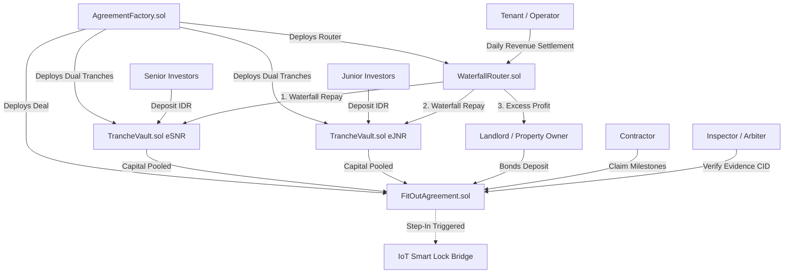

# 15. Euthial Protocol: External Security Audit Scope & Preparation (#86)

Dokumen persiapan resmi untuk **External Smart Contract Security Audit** Euthial Protocol sebelum deployment mainnet. Dokumen ini dirancang sebagai Request for Proposal (RFP) dan panduan teknis bagi firma audit independen (misalnya *Code4rena, Sherlock, Cantina / Spearbit, atau Trail of Bits*).

---

## 🎯 1. Ringkasan Eksekutif & Komitmen Audit

Euthial Protocol adalah protokol pembiayaan Revenue-Based Financing (RBF) untuk fit-out properti komersial (ruko) di Indonesia yang mengintegrasikan:
- Kontrak modal dual-tranche ERC-4626 (**Senior & Junior Tranche**).
- Dynamic waterfall routing & cash-flow automated distribution (**WaterfallRouter**).
- Multistage fit-out construction milestone escrow (**FitOutAgreement**).
- Legal property tokenization binding (**PropertyNFT**).
- Off-chain verifiable attestations (SNAP BI / EIP-712 / QRIS) & IoT hardware step-in enforcement.

### Target Periode & Anggaran
- **Target Periode Audit**: 2 - 3 Pekan
- **Target Pelaksanaan**: Q4 2026 / Pre-Mainnet Release
- **Estimasi Alokasi Budget**: **$15,000 – $35,000 USD** (Tergantung model: Public Contest vs Private Audit Firm)

---

## 📊 2. Scope of Audit & Source Lines of Code (SLOC)

Audit hanya berfokus pada smart contract inti di folder `contracts/src/`. Library OpenZeppelin (ERC20, ERC4626, Ownable, ReentrancyGuard, Pausable) diasumsikan aman dan berada di luar cakupan mendalam, kecuali pola integrasi dan override-nya.

### Tabel Rincian Kontrak Inti

| Smart Contract | Path | SLOC | Kompleksitas | Komponen Kritis & Risiko Utama |
|---|---|:---:|:---:|---|
| **WaterfallRouter.sol** | `contracts/src/WaterfallRouter.sol` | 317 | **Tinggi** | Algoritma waterfall settlement, rounding precision, handling residual revenue, priority transfer. |
| **FitOutAgreement.sol** | `contracts/src/FitOutAgreement.sol` | 195 | **Tinggi** | Finite State Machine (FUNDING -> FIT_OUT -> SERVICING -> STEP_IN -> RESIDUAL), draw-down deposit bond, milestone approvals. |
| **AgreementFactory.sol** | `contracts/src/AgreementFactory.sol` | 192 | **Sedang** | Deployer permissioned, parameter validation, role binding, deal metadata registry. |
| **TrancheVault.sol** | `contracts/src/TrancheVault.sol` | 172 | **Tinggi** | ERC-4626 standard compliance, share inflation protection, principal + return multiple cap (1.25x/1.40x). |
| **PropertyNFT.sol** | `contracts/src/PropertyNFT.sol` | 130 | **Rendah** | ERC-721 tokenization, sertifikat SHM/HGB cryptographic hash binding, transfer restrictions. |
| **EuthialIDR.sol** | `contracts/src/EuthialIDR.sol` | 83 | **Rendah** | Synthetic IDR settlement token, minter access control, ERC-20 standard behavior. |
| **TOTAL IN-SCOPE SLOC** | | **1,089** | | **Target Scope: ~1,100 nSLOC** |

*Catatan: `contracts/src/MockIDR.sol` (43 lines) adalah mock testnet dan dikecualikan dari scope audit.*

---

## 🏛️ 3. Arsitektur Smart Contract & Data Flow Diagram

Diagram relasi interaksi kontrak dan alur likuiditas dana:



---

## 🛡️ 4. Known Issues & Mitigasi Internal yang Telah Dilakukan

Auditor diharapkan tidak melaporkan temuan pada vektor risiko yang telah secara sadar dimitigasi dalam arsitektur:

1. **ERC-4626 Inflation / First-Deposit Front-Running**:
   - *Mitigasi*: Dead shares deposit (1,000 units pertama di-burn/lock ke address(0)) dan pembatasan initial deposit via Factory.
2. **Reentrancy pada Distribusi Dana**:
   - *Mitigasi*: Seluruh fungsi penarikan likuiditas (`distributeSettlement`, `withdrawMilestone`, `claimBond`) menerapkan `ReentrancyGuard` OpenZeppelin serta pola *Checks-Effects-Interactions*.
3. **Integer Division / Precision Loss (Solidity Math)**:
   - *Mitigasi*: Basis points (`10_000 = 100%`) digunakan secara konsisten. Pembulatan pembagian selalu diarahkan untuk menguntungkan proteksi vault modal (round down untuk shares payout, round up untuk hutang remaining).
4. **Stack Too Deep Exception**:
   - *Mitigasi*: Kompilasi diselaraskan dengan `--via-ir` dan optimasi compiler 200 runs di `foundry.toml`.
5. **Oracle Front-Running / Tampering**:
   - *Mitigasi*: Attestasi revenue harian menggunakan EIP-712 domain separator unik dengan multi-oracle threshold (2-of-3 signatures).

---

## 🧪 5. Testing Suite & Formal Verification Status

Protokol telah dilengkapi test suite yang komprehensif sebelum diajukan ke auditor eksternal:

### A. Unit Tests (100% Contract Coverage)
- `AgreementFactory.t.sol`: Verifikasi deployment parameter bounds, permissioning deal creator.
- `FitOutAgreement.t.sol`: Verifikasi siklus milestone, bond locks, dan finite state transitions.
- `TrancheVault.t.sol`: Pengujian ERC-4626 deposit/withdraw/redeem, share accounting.
- `WaterfallRouter.t.sol`: Pengujian waterfall 3-tier cascade, prorata shares, dan edge cases residual.
- `PropertyNFT.t.sol`: Registrasi NFT, sertifikat hash, aksesibilitas token URI.
- `EuthialIDR.t.sol`: Access control minter/burner, minting caps.

### B. Fuzzing & Invariant Testing (Stateful Fuzzing)
- `FuzzSettlement.t.sol`: Fuzzing 10,000 kombinasi nominal revenue dari 0 hingga 10 Triliun IDR.
- `FuzzBond.t.sol`: Fuzzing drawdown dan refund bond pada random intervals.
- `FuzzCovenant.t.sol`: Fuzzing breach conditions dengan nilai shortfall acak.
- `ProtocolInvariant.t.sol`: **Formal Invariant Rules**:
  1. `Total Assets Di Router == 0` (Router bersifat non-custodial, semua dana harus segera terdistribusi).
  2. `Total Payout Senior <= Senior Principal * SeniorMultipleBps / 10000`.
  3. `Total Payout Junior <= Junior Principal * JuniorMultipleBps / 10000`.
  4. `Sum(Vault Shares) selalu didukung oleh 100% underlying assets atau klaim utang riil`.

---

## 🏢 6. Rekomendasi Opsi Audit Firm & Perbandingan

| Opsi Audit Platform | Tipe Pelaksanaan | Estimasi Biaya | Estimasi Durasi | Keunggulan & Kesesuaian |
|---|---|:---:|:---:|---|
| **Code4rena** | Public Competitive Contest | $20,000 – $28,000 | 7 – 10 Hari | Sangat efektif menemukan edge cases dan economic bugs karena dikerjakan puluhan wardens independen. Cocok untuk protokol RWA baru. |
| **Sherlock** | Contest + Exploit Coverage | $25,000 – $35,000 | 14 Hari | Termasuk garansi coverage exploit pasca-audit jika bug lolos. Memberikan rasa aman tinggi bagi institusi investor. |
| **Cantina (Spearbit)** | Private Boutique Review | $22,000 – $35,000 | 10 – 14 Hari | Dipimpin oleh auditor top tier industri. Sangat mendalam pada arsitektur ERC-4626 dan matematika DeFi. |
| **Firma Keamanan Lokal / Regional** | Private Review | $8,000 – $15,000 | 14 – 21 Hari | Biaya lebih efisien, memudahkan koordinasi zona waktu WIB, namun reputasi global DeFi lebih rendah dibanding C4/Sherlock. |

---

## ✉️ 7. Template Engagement Letter & Request for Proposal (RFP)

Template resmi yang siap dikirimkan tim Euthial ke audit firm:

```text
Subject: [RFP] Smart Contract Security Audit Request - Euthial Protocol

Dear [Audit Firm Name] Team,

We would like to request an audit proposal for Euthial Protocol (Verifiable Revenue-Based Financing on Ethereum/Sepolia).

Project Overview:
- Repository: https://github.com/AlphaIsYour/euthial
- Target Branch / Commit: docs/audit-preparation (Commit 28bcd08)
- Scope: 6 Smart Contracts (contracts/src/)
- Total In-Scope nSLOC: ~1,089 lines
- Language: Solidity 0.8.24 (Foundry framework, via_ir: true)
- Standards Implemented: ERC-4626 (Dual Tranche), ERC-721 (RWA NFT), EIP-712 (Oracle Attestations)
- Key Architecture Docs: docs/05_SMART_CONTRACT_SPEC.md & docs/15_EXTERNAL_SECURITY_AUDIT_SCOPE.md

Requested Engagement:
- Estimated Start Date: [Target Date, e.g. November 2026]
- Preferred Format: [Public Contest / Dedicated Team Audit]
- Deliverables: Comprehensive Vulnerability Report + Mitigation Review Period

Please share your availability, estimated quote, and next onboarding steps.

Best regards,
Euthial Protocol Security Core Team
team@euthial.finance
```

---

## ✅ 8. Checklist Kesiapan Audit (Audit Readiness Checklist)

- [x] Scope document & SLOC breakdown terdefinisi secara presisi.
- [x] NatSpec dokumentasi lengkap di seluruh fungsi publik dan internal smart contracts.
- [x] Arsitektur data flow & Mermaid diagrams selesai dipetakan.
- [x] Known issues & mitigasi formal terdokumentasi (tidak membuang waktu auditor).
- [x] Unit test, fuzz test, dan invariant testsuite berjalan dengan 100% kelulusan.
- [x] Estimasi budget & perbandingan audit firm tersedia.
- [x] Template formal engagement RFP siap dikirimkan.
